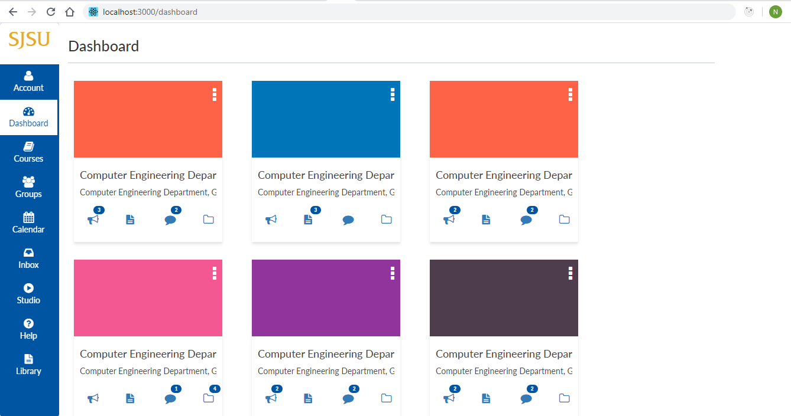
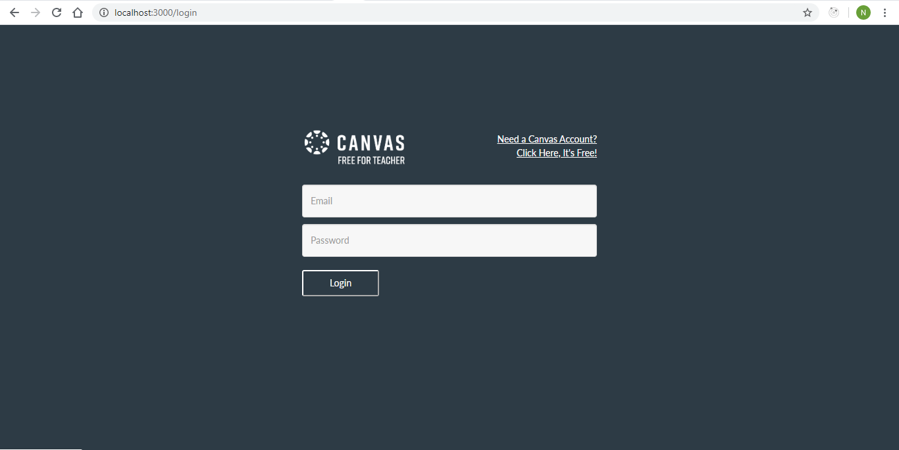
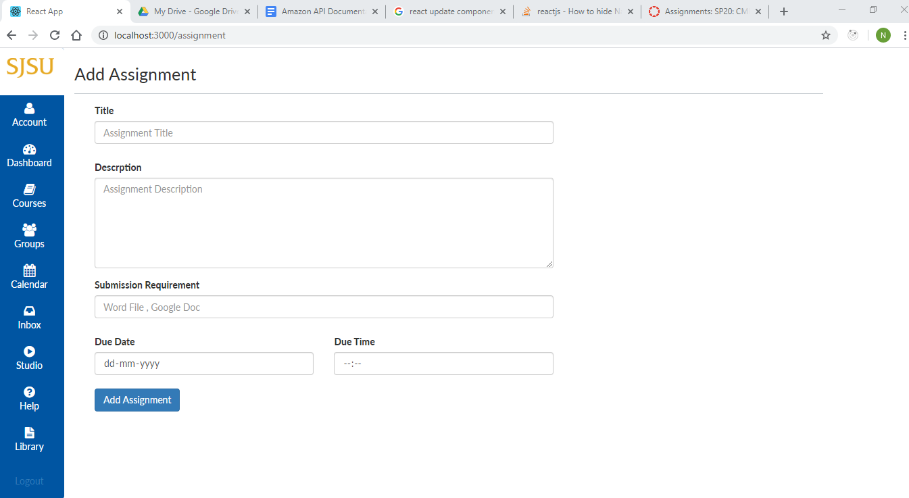

# canvas-app
CANVAS Assignment with MERN stack
## Key features
1. Backend testing using Mocha & Chai
2. JWT token based authentication using passport.js
3. Separate repository,controller and route layers in backend
4. EsLint to maintain code quality
### Steps to deploy the application
#### Frontend
1. Clone the repository's front end folder "frontend" into any machine having node.js installed on it.
2. Open the terminal in the folder "frontend".
3. Execute `npm install` to install all the dependencies.
4. Update the webConfig.js file in frontend/src folder with the backend server's IP address and port.
5. Execute `npm start` to run the front end server.
#### Backend
1. Clone the repository's backend end folder "backend" into any machine having node.js installed on it.
2. Open the terminal in the folder "backend".
3. Execute `npm install` to install all the dependencies.
4. Update the config.js file in backend/helperFunctions folder with the frontend server's IP address and port.
5. Execute `npm start` to run the backend server.
#### Backend Testing with Mocha & Chai
1. Open the terminal in the folder "backend".
2. Execute `npm test` to run the tests.
#### Launch the application
Open the browser and navigate to Front end server's IP address with Port number (Eg: localhost:3000) to find the landing page.
#### Screens
</img>
</img>
</img>

